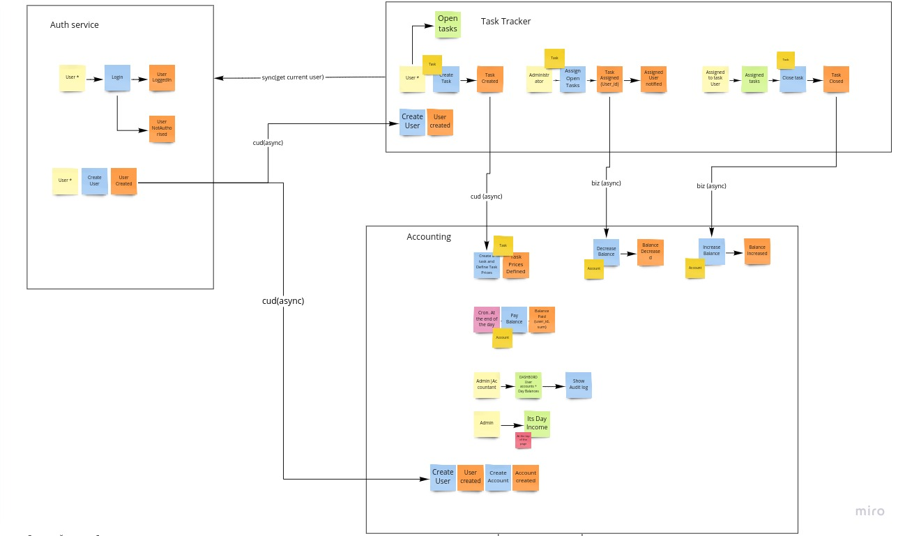
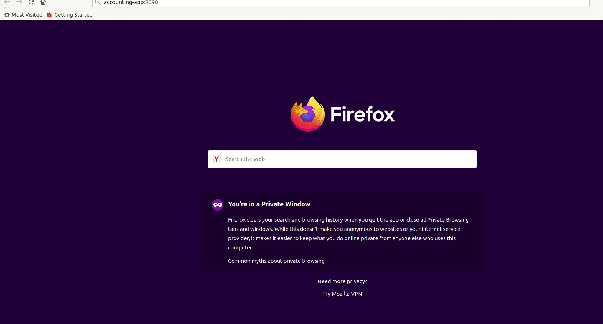

# Multiservices Pet project

The project consists of 3 services:
- AuthServer - authentication service + user managements
- TaskTracker - task dashboard, task management
- Accounting - employee income/loss money dashboard

Business processes and communication between services are shown in the picture below.



Demo of the main flow.
--


**Run Project in Docker-compose**
-
- add to /etc/hosts "127.0.0.1 auth-server"
- add to /etc/hosts "127.0.0.1 accounting-app"

```
cp .env.dist .env

./gradlew -p authServer build
./gradlew -p taskTraker build
./gradlew -p accounting build

docker-compose -f docker/docker-compose-full.yaml up
```

**TaskTracker** application host is http://localhost:8080/todo  
**Accounting** application host is http://accounting-app:8090  
**AuthServer** application host is http://auth-server:9000

By default, AuthServer has 2 users(username / password):
- admin_2 / pass
- employee_2 / pass
